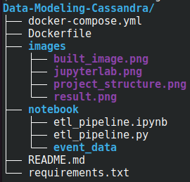

# Data Modeling with Cassandra

This project is part of [Udacity Data Engineer nanodegree program](https://www.udacity.com/course/data-engineer-nanodegree--nd027)

## Overview

A startup called Sparkify wants to analyze the data they've been collecting on songs and user activity on their new music streaming app. The analysis team is particularly interested in understanding what songs users are listening to. Currently, there is no easy way to query the data to generate the results, since the data reside in a directory of CSV files on user activity on the app.

They'd like a data engineer to create an Apache Cassandra database which can create queries on song play data to answer the questions.

## Mission

My role as data engineer is to create a cassandra database for this analysis. I'll design tables according to queries provided by analytics team from Sparkify. To achieve this, I'll build an ETL pipeline that will transfer data from a set of CSV files within a directory into apache cassandra tables.

## Project structure

## Quickstart

**REQUIREMENT**: docker and docker-compose are already installed.

1. Clone this repository: `https://github.com/mdifils/Data-Modeling-Cassandra.git`
2. Change directory: `cd Data-Modeling-Cassandra`
3. Build image: `docker-compose build --no-cache`

> You may have the following warning but that's okay.

4. Create and run containers: `docker-compose up -d`
5. Check containers are running: `docker-compose ps`
6. check jupyterlab link (last line): `docker-compose logs jlab`
7. Copy jupyterlab link and paste it in your browser.

